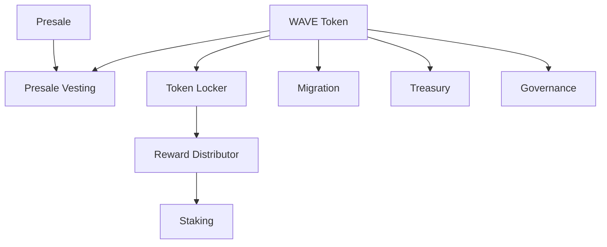

<div align="center">

# OneWave Smart Contract Ecosystem

### A complete token infrastructure suite built by IdeaHatch Labs

[](https://soliditylang.org/)
[](https://www.bnbchain.org/)
[](https://hardhat.org/)
[](https://www.openzeppelin.com/contracts)

**Token · Presale · Vesting · Staking · Rewards · Migration · Treasury · Governance**

</div>

---

## Project Overview

OneWave required more than a standalone token contract. The ecosystem needed a connected on-chain foundation that could manage the complete WAVE token lifecycle, from initial supply and token sale to long-term vesting, staking, treasury operations, migration and community governance.

**IdeaHatch Labs designed and developed a modular suite of nine Solidity smart contracts for OneWave on BNB Smart Chain.** Each module has a focused responsibility while working as part of one coordinated ecosystem.

This repository is presented as a portfolio showcase of our smart contract architecture and Web3 development work.

## Project Snapshot

| | |
| --- | --- |
| **Client** | OneWave |
| **Developed by** | IdeaHatch Labs |
| **Project type** | Token ecosystem and smart contract infrastructure |
| **Blockchain** | BNB Smart Chain |
| **Token** | OneWave (`WAVE`) |
| **Maximum supply** | 250,000,000 WAVE |
| **Contracts delivered** | 9 core contracts |
| **Completion date** | 02 February 2026 |
| **Core stack** | Solidity, OpenZeppelin, Hardhat, TypeScript and Viem |

## The Challenge

The project needed to coordinate several high-risk on-chain operations without concentrating all logic in one oversized contract. The main requirements included:

- Enforcing a fixed WAVE supply and defined allocation model
- Supporting multiple presale rounds and payment methods
- Applying different vesting rules to investors and ecosystem categories
- Distributing long-term staking rewards without unbounded emissions
- Supporting a controlled migration from an earlier token
- Managing protocol funds across WAVE, ERC-20 assets and native BNB
- Giving token holders an on-chain proposal and voting system
- Protecting privileged operations through clear access controls

Our goal was to turn these requirements into a modular system that was easier to understand, configure, test and maintain.

## Our Solution

We separated the ecosystem into nine purpose-built contracts. The WAVE token remains the central asset, while dedicated modules manage sales, vesting, staking, rewards, treasury activity, migration and governance.



This architecture keeps responsibilities isolated and makes security boundaries clearer. Individual components can be configured around OneWave's launch and operational requirements without mixing unrelated financial logic.

## What We Built

| Contract | Delivery |
| --- | --- |
| `WaveToken.sol` | Fixed-supply WAVE token with burn, pause, EIP-2612 permit and hard-capped migration minting. |
| `Presale.sol` | Three configurable sale rounds supporting approved ERC-20 payments and native BNB. |
| `PresaleVesting.sol` | Round-specific investor vesting with TGE unlocks, cliffs, linear release and allocation caps. |
| `TokenLocker.sol` | Allocation and vesting management for eight non-presale token categories. |
| `Staking.sol` | WAVE staking with O(1) reward accounting, configurable lock duration and bounded reward emissions. |
| `RewardDistributor.sol` | Controlled staking funding plus individual and batch community reward distributions. |
| `Migration.sol` | Time-limited old-token migration with a configurable conversion ratio and supply-cap protection. |
| `Treasury.sol` | Multi-asset treasury supporting WAVE, other ERC-20 tokens and native BNB. |
| `Governance.sol` | Token-based proposals, locked voting, quorum, finalization and a timelocked proposal lifecycle. |

## Key Engineering Highlights

### Fixed-Supply Token Design

The full supply of **250 million WAVE** is created at deployment. Migration minting is role-restricted and cannot increase the total supply beyond the original hard cap. This allows burned legacy tokens to be replaced without introducing additional inflation.

### Flexible Multi-Round Presale

The presale supports three separately configured rounds. OneWave can set round allocations, prices for different payment assets, minimum and maximum purchase limits and optional whitelist requirements. Purchases automatically create the buyer's corresponding vesting schedule.

### Two-Layer Vesting Architecture

Investor vesting and ecosystem allocation vesting are handled independently:

- `PresaleVesting` manages buyer allocations across the three sale rounds.
- `TokenLocker` manages staking, ecosystem, liquidity, marketing, team, advisor, airdrop and reserve allocations.

This separation prevents presale logic from becoming coupled to internal token distribution.

### Sustainable Staking Rewards

The staking module uses a reward-per-token accumulator, allowing reward calculations to remain constant-time as the number of users grows. Reward accrual stops at a configured end time, the reward rate is capped and a solvency check helps prevent promised rewards from exceeding available funding.

### Controlled Token Migration

The migration contract allows holders of an earlier burnable token to exchange it for WAVE during a defined window. Old tokens are burned, the conversion ratio is configurable and new WAVE remains subject to the 250M maximum supply.

### Locked-Token Governance

Proposal creators and voters must lock WAVE, making flash-loan and transferred-token manipulation more difficult. Proposals move through voting, finalization, queuing and timelocked completion, with a 14-day grace period for queued proposals.

The current module records and finalizes governance decisions on-chain. It does not perform arbitrary target contract calls or calldata execution.

## Token Allocation Model

| Allocation | WAVE | Supply | TGE unlock | Cliff | Vesting |
| --- | ---: | ---: | ---: | ---: | ---: |
| Presale | 75,000,000 | 30% | Configurable | Configurable | Configurable |
| Staking and rewards | 45,000,000 | 18% | 0% | None | 60 months |
| Ecosystem | 37,500,000 | 15% | 5% | 6 months | 36 months |
| Liquidity | 25,000,000 | 10% | 100% | None | None |
| Marketing | 25,000,000 | 10% | 10% | 3 months | 24 months |
| Team | 17,500,000 | 7% | 0% | 12 months | 36 months |
| Advisors | 10,000,000 | 4% | 0% | 9 months | 24 months |
| Airdrop | 10,000,000 | 4% | 50% | None | 12 months |
| Reserve | 5,000,000 | 2% | 0% | 12 months | 48 months |
| **Total** | **250,000,000** | **100%** | | | |

> Contract durations use 30-day months.

## Security-Focused Development

Security controls were applied throughout the system rather than added to a single layer:

- Role-based permissions using OpenZeppelin `AccessControl`
- Emergency pausing for critical modules
- Reentrancy protection around external transfers
- `SafeERC20` for token interactions
- Fixed token-supply and allocation caps
- One-time TGE configuration
- Bounded batch distributions
- Reward-rate, duration and solvency controls
- Locked proposal deposits and voting balances
- Governance timelock and proposal expiry
- Custom errors and explicit input validation
- Checks-effects-interactions ordering

These controls reduce common operational and smart contract risks, but they are not a substitute for an independent production audit.

## Our Contribution

IdeaHatch Labs handled the smart contract work across the ecosystem, including:

- Contract-system architecture
- Token and allocation modelling
- Solidity implementation
- Cross-contract integration design
- Role and permission structure
- Presale and vesting flows
- Staking and rewards logic
- Migration safeguards
- Treasury operations
- Governance lifecycle
- BNB Smart Chain development configuration
- NatSpec documentation and maintainable code structure

## Product Outcomes

The completed system gave OneWave:

- One modular foundation for the full token lifecycle
- Transparent on-chain allocation and vesting rules
- A flexible presale supporting multiple assets and round configurations
- Bounded, externally funded staking emissions
- Separate controls for treasury, rewards and token migration
- A governance foundation for token-holder participation
- A codebase structured for further testing, auditing and deployment work

No unverified usage, financial or performance metrics are claimed in this portfolio.

## Technology Stack

| Layer | Technology |
| --- | --- |
| Smart contracts | Solidity `0.8.28` |
| Security libraries | OpenZeppelin Contracts `5.6` |
| Development framework | Hardhat `3` |
| Development language | TypeScript |
| Blockchain interaction | Viem |
| Deployment tooling | Hardhat Ignition |
| Target network | BNB Smart Chain |

## Repository Structure

```text
contracts/
├── WaveToken.sol
├── Presale.sol
├── PresaleVesting.sol
├── TokenLocker.sol
├── Staking.sol
├── RewardDistributor.sol
├── Migration.sol
├── Treasury.sol
├── Governance.sol
└── mocks/
    └── MockERC20.sol

hardhat.config.ts
package.json
tsconfig.json
```

## Review the Code Locally

```bash
git clone <your-repository-url>
cd onewave-bsc-contracts
npm ci
npx hardhat compile
```

Never commit private keys, wallet seed phrases or production credentials to the repository.

## Important Notice

This repository is shared to demonstrate the development work completed for OneWave. Smart contracts should undergo complete testing, deployment rehearsal and an independent security audit before handling production assets. No live deployment address or external audit is claimed in this repository unless separately published and verifiable.

## About IdeaHatch Labs

**IdeaHatch Labs** is a product and technology studio building across Web2, AI and Web3. We work with founders and teams from product architecture to launch, covering full-stack platforms, AI automation, smart contracts, decentralized applications and blockchain integrations.

For this project, we transformed OneWave's token ecosystem requirements into a structured suite of connected smart contracts designed for clarity, control and future expansion.

---

<div align="center">

### Built by IdeaHatch Labs for OneWave

*Web2 · AI · Web3 · Product Development*

</div>
